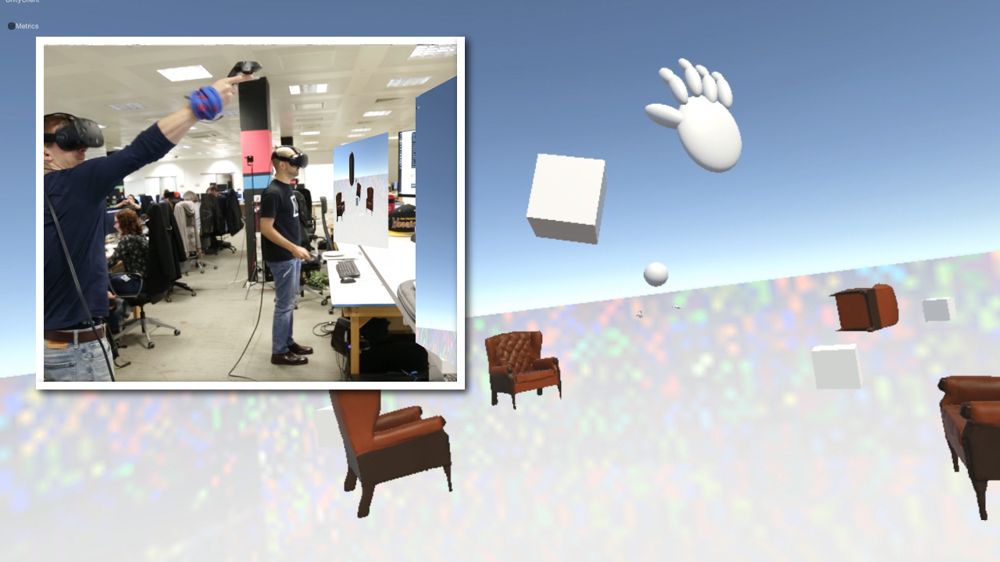

# Virtual Reality starter project

*Copyright Improbable Worlds Ltd, 2017*

- *GitHub repository*: [https://github.com/spatialos/VRStarterProject](https://github.com/spatialos/VRStarterProject)

---

## Introduction

This is a SpatialOS project that implements basic functionality for a VR game or application, intended as a starting point for developing your own. It requires SteamVR hardware (the [HTC Vive](https://www.htcvive.com/) headset, controllers, and base stations).

The main features of this project are:

* Players controlled by VR peripherals.
* Spectators controlled by mouse and keyboard.
* Multiplayer by default. Many players and spectators can share the same world.
* Position and orientation tracking of headset and controllers.
* Move by teleporting. Press the trackpad on either controller, move the target, and release the trackpad to teleport to the target location.
* Grab objects, pass them between hands, throw them, and catch them.

If you run into problems, or want to give us feedback, please visit the [SpatialOS forums](https://forums.improbable.io/).

## Running the project

To run the project locally, first build it by running `spatial worker build`, then start the server with `spatial local start`. You can connect a client by opening the Unity project and pressing the play button, or by running `spatial local worker launch UnityClient default`. See the [documentation](https://spatialos.improbable.io/docs/reference/latest/developing/local/run) for more details.

To deploy the project to the cloud, first build it by running `spatial worker build -t=deployment`, then upload the assembly with `spatial cloud upload <assembly name>`, and finally deploy it with `spatial cloud launch <assembly name> <launch configuration file> <deployment name> --snapshot=<snapshot file>`. You can obtain and share links to connect to the deployment from the [console](http://console.improbable.io/projects). See the [documentation](https://spatialos.improbable.io/docs/reference/latest/developing/deploy-an-application) for more details.

## Project structure and design overview

### Player entity and peripheral tracking

The player is represented by an entity. Its position corresponds to the centre of the Vive's play area, an abstraction that represents the physical space that is tracked by the base stations.

The position of the player's head tracks that of the Vive headset, and the player's hands track that of controllers. Those positions are stored as offsets from the player's position. Input from the headset and the controllers is handled by [`VrPeripheralHandler.cs`](workers/unity/Assets/Gamelogic/Player/VRPeripheralHandler.cs), and players are visualised by [`VrPeripheralVisualiser.cs`](workers/unity/Assets/Gamelogic/Player/VRPeripheralVisualiser.cs).

This approach to the player's position is specific to the HTC Vive with its play area. A more usual approach for SpatialOS would have the position of the player entity match the position of the player's head; however, the approach used in this project has several advantages, including a more straightforward implementation, lower bandwidth requirements (since offsets can be transmitted using smaller data types than absolute world positions), and a familiar model for experienced SteamVR developers.

The main downside is that physically moving within the play area will not cause the player entity to move when seen on the [Inspector](https://spatialos.improbable.io/docs/reference/latest/tools/inspector). This may not matter much, since the the SpatialOS world will normally be orders of magnitude bigger than the average living room, so most of the player movement will be done by teleporting. We may revisit this design tradeoff in future iterations of this project.

### Teleportation

Teleportation is implemented client-side. When the player presses the trackpad on either controller, a teleport targeter is displayed. The player can move it around to choose their desired destination, and release the trackpad to perform the teleport. All of this is implemented in [`TeleportationHandler.cs`](workers/unity/Assets/Gamelogic/Player/TeleportationHandler.cs).

### Spectator camera

Spectators are players who connect without a VR headset. They are limited to moving around and viewing the game world, but can't interact with it. The camera orientation is controlled with the mouse, and its position is controlled with the WASD keys. Spectators are visible in-game to other spectators and to players. This is done in [`SpectatorFlycam.cs`](workers/unity/Assets/Gamelogic/Player/SpectatorFlycam.cs).

### Grabbing and throwing objects

Entities can be easily marked as _grabbable_, which lets them be picked up, dropped and thrown. When the client detects a collision between a controller and a grabbable object, it adds it to a set of _reachable_ objects; when the collision ends, the object is removed (by keeping this set, we avoid having to search for nearby objects constantly). The closest reachable object is highlighted by being made blue. This is done in [`HandCollisionHandler.cs`](/workers/unity/Assets/Gamelogic/Player/HandCollisionHandler.cs), and happens entirely on the client.

When the trackpad is pressed, a `GrabRequestEvent` with the entity ID of the closest reachable object is emitted by [`GrabbingSender.cs`](workers/unity/Assets/Gamelogic/Grabbing/GrabbingSender.cs) on the client side. This event is handled by [`GrabbingReceiver.cs`](workers/unity/Assets/Gamelogic/Grabbing/GrabbingReceiver.cs) on the server side. It validates the grab attempt (that is, verifies that the hand and the object are actually colliding). If it is valid, it updates the `CurrentGrabberInfo` property of the `Grabbable` component to record which player and controller is grabbing it. When the trackpad is released, a very similar process handles dropping an object that is being held.

While an object is being held, its position and orientation track those of the controller than is holding it. This is done in every client, to ensure there's no jitter between the position and orientation of the object and the controller. When an object is released, its velocity is set to match that of the controller; this way, objects can be thrown. All of this is implemented in [`GrabbableTransformHandler.cs`](workers/unity/Assets/Gamelogic/Grabbing/GrabbableTransformHandler.cs).
